

# فونت‌های فارسی آزاد 🎨

مجموعه‌ای از فونت‌های آزاد و متن‌باز فارسی به همراه توضیحات، سبک، تعداد وزن‌ها و لینک دریافت.

**[English version](README-en.md)**

| پیش‌نمایش | نام | سبک | وزن‌ها | جزئیات |
| :---: | ---: | ---: | ---: | :---: |
| 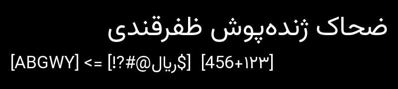 | وزیرمتن Vazirmatn | سنس | متغیر | [ ↩](#vazirmatn) |
| 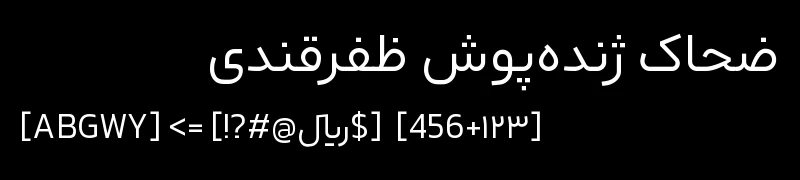 | آراد Arad | سنس | متغیر | [ ↩](#aradvf) |
| 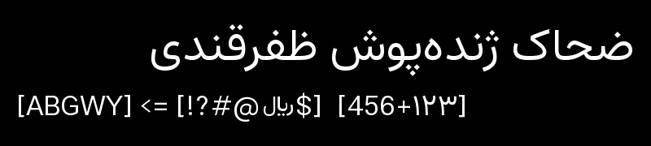 | نرمال سنس Normal Sans | سنس | متغیر | [ ↩](#aq-normal-sans) |
| 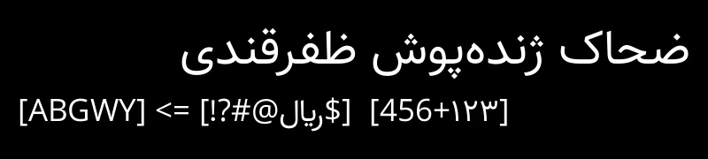 | صمیم Samim | سنس | ۳ وزن | [ ↩](#samim) |
| 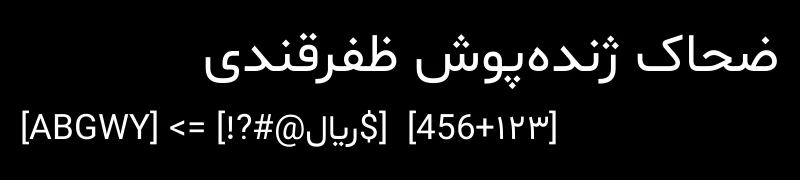 | شبنم Shabnam | سنس | ۲ وزن | [ ↩](#shabnam) |
| 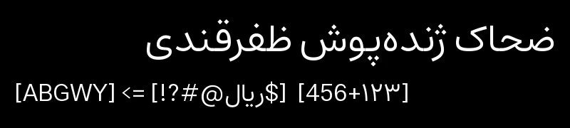 | استعداد Estedad | سنس | متغیر | [ ↩](#estedad) |
| 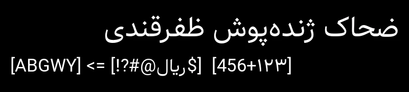 | سپهر Sepehr | سنس | ۵ وزن | [ ↩](#sepehr) |
| 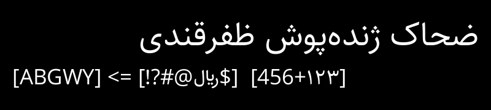 | ساحل Sahel | سنس | متغیر | [ ↩](#sahel) |
| 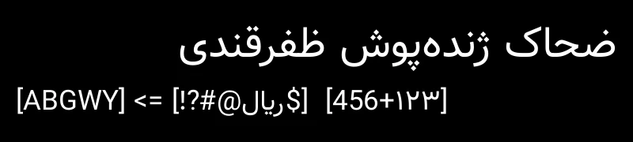 | ناهید Nahid | سنس | ۱ وزن | [ ↩](#nahid) |
| 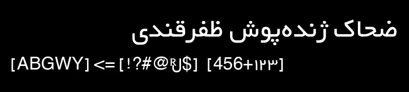 | XM یکان XM Yekan | سنس | ۱ وزن | [ ↩](#xm-yekan) |
| 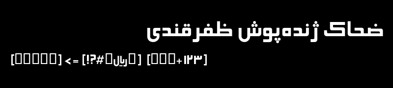 | الهام Elham | سنس | ۱ وزن | [ ↩](#elham) |
| 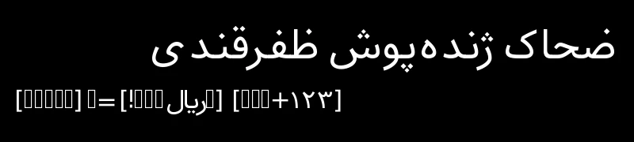 | گنجنامه Ganjnameh | سنس | ۱ وزن | [ ↩](#ganjnamehsans) |
| 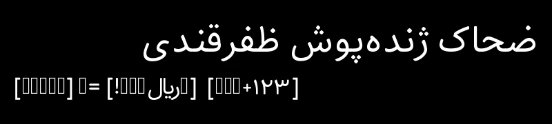 | بهداد Behdad | سنس | ۱ وزن | [ ↩](#behdad) |
| 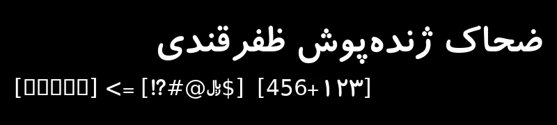 | کودک Koodak | سنس | ۱ وزن | [ ↩](#koodak) |
| 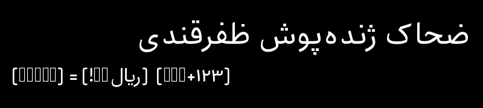 | شهاب Shahab | سنس | ۱ وزن | [ ↩](#shahab) |
| 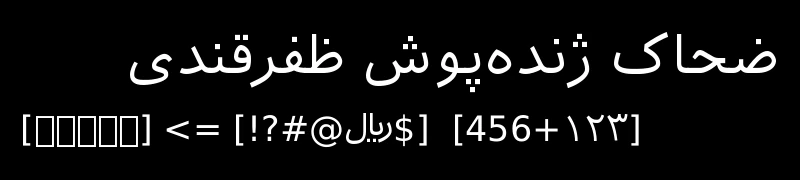 | ایرانیان سنس Iranian Sans | سنس | ۲ وزن | [ ↩](#iranian-sans) |
| 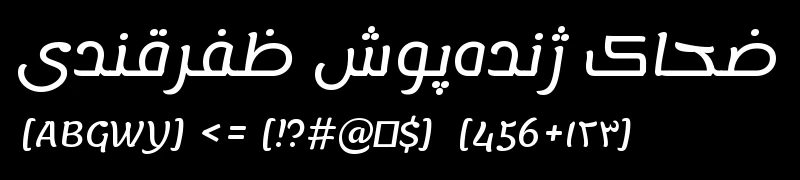 | لمونادا Lemonada | سنس | متغیر | [ ↩](#lemonada) |
|  | الن سنس Alan Sans | سنس | متغیر | [ ↩](#alan_sans) |
| 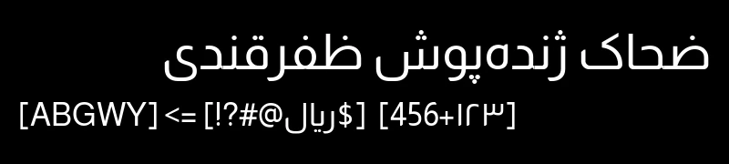 | المراعی Almarai | سنس | ۴ وزن | [ ↩](#almarai) |
| 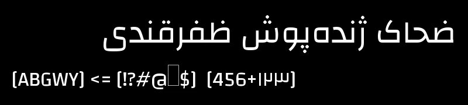 | چنگا Changa | سنس | متغیر | [ ↩](#changa) |
| 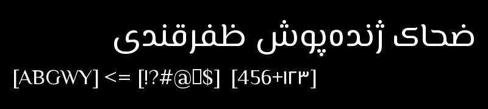 | المسیری El Messiri | سنس | متغیر | [ ↩](#el-messiri) |
| 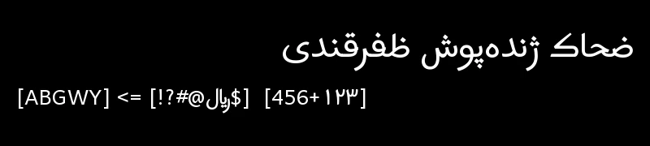 | هارماتان Harmattan | سنس | ۴ وزن | [ ↩](#harmattan) |
| 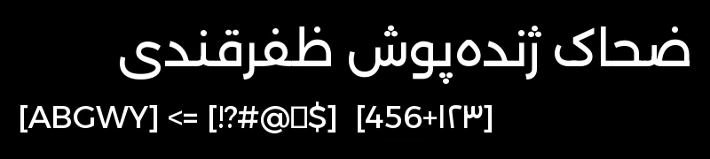 | اسکندریه Alexandria | سنس | متغیر | [ ↩](#alexandria) |
| 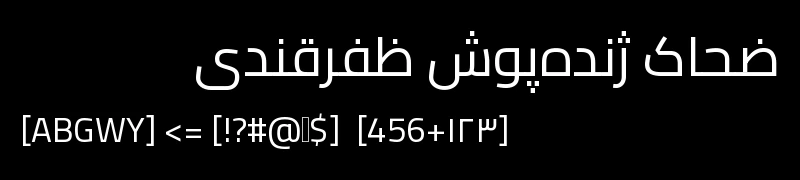 | قاهره Cairo | سنس | متغیر | [ ↩](#cairo) |
|  | ریم کوفی Reem Kufi | سنس | متغیر | [ ↩](#reem_kufi) |
| 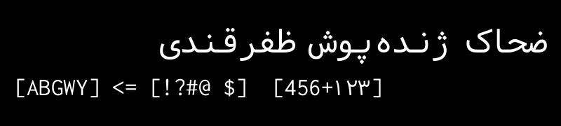 | وزیرکد Vazir Code | تک‌فاصله | ۱ وزن | [ ↩](#vazir-code) |
| 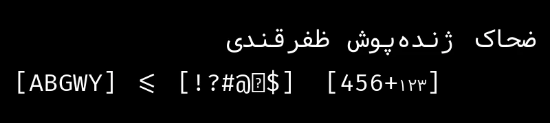 | ویرا Vira | تک‌فاصله | ۱ وزن | [ ↩](#vira) |
| 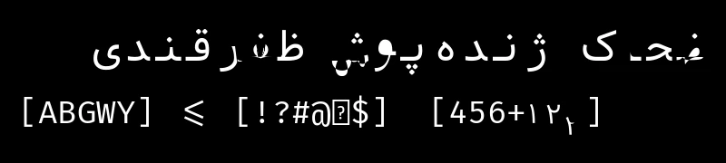 | زیراکد Zira Code | تک‌فاصله | ۱ وزن | [ ↩](#zira-code) |
| 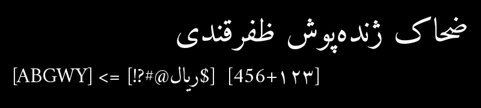 | امیری Amiri | سریف | ۲ وزن | [ ↩](#amiri) |
| 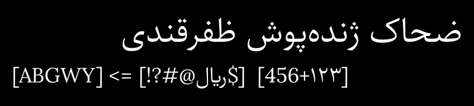 | پرستو Parastoo | سریف | ۲ وزن | [ ↩](#parastoo) |
| 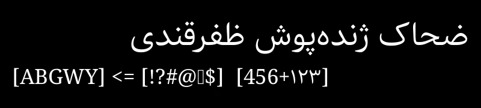 | گندم Gandom | سریف | ۱ وزن | [ ↩](#gandom) |
| 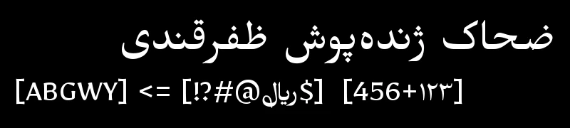 | میرزا Mirza | سریف | ۴ وزن | [ ↩](#mirza) |
| 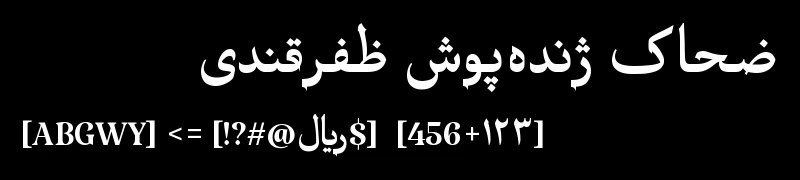 | کتیبه Katibeh | سریف | ۱ وزن | [ ↩](#katibeh) |
| 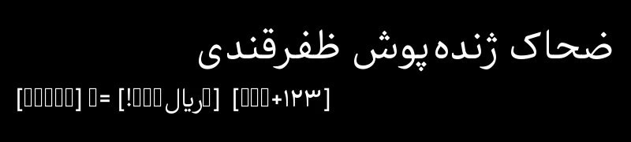 | نیکا Nika | سریف | ۱ وزن | [ ↩](#nika) |
| 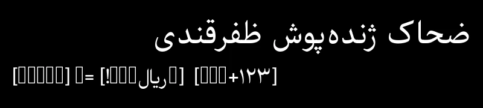 | فربد Farbod | سریف | ۱ وزن | [ ↩](#farbod) |
| 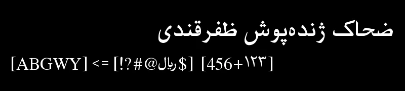 | فری‌فارسی FreeFarsi | سریف | ۲ وزن | [ ↩](#freefarsi) |
| 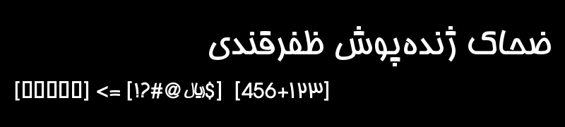 | هما Homa | سریف | ۱ وزن | [ ↩](#homa) |
| 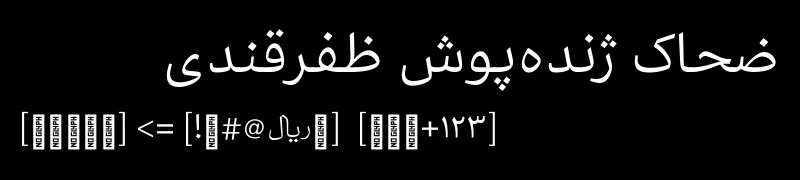 | قلم آزاد Free Persian Font | سریف | ۱ وزن | [ ↩](#pfont) |
| 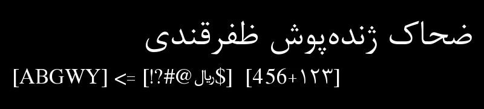 | نازلی Nazli | سریف | ۲ وزن | [ ↩](#nazli) |
| 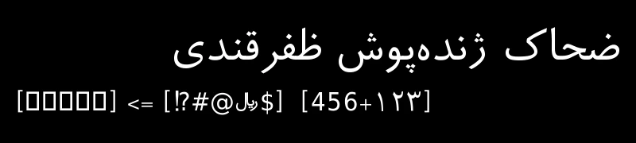 | رویا Roya | سریف | ۲ وزن | [ ↩](#roya) |
| 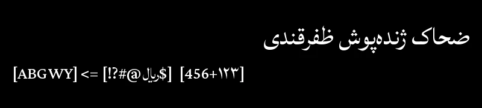 | لطیف Lateef | سریف | ۷ وزن | [ ↩](#lateef) |
|  | عارف رقعه Aref Ruqaa | سریف | ۲ وزن | [ ↩](#aref_ruqaa) |
|  | شهرزاد نیو Scheherazade New | سریف | ۴ وزن | [ ↩](#scheherazade_new) |
|  | مرکزی تکست Markazi Text | سریف | متغیر | [ ↩](#markazi_text) |
| 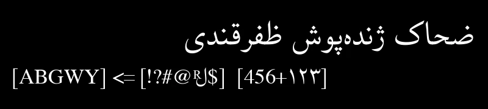 | XB یاس XB Yas | سریف | ۲ وزن | [ ↩](#xb-yas) |
| 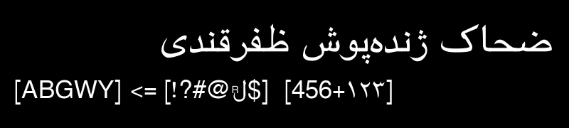 | XB ریاض XB Riyaz | سریف | ۲ وزن | [ ↩](#xb-riyaz) |
| 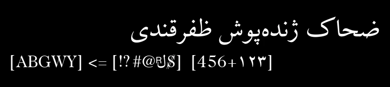 | XB زر XB Zar | سریف | ۲ وزن | [ ↩](#xb-zar) |
| 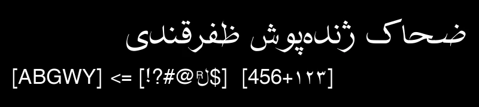 | XB شفیق XB Shafigh | سریف | ۲ وزن | [ ↩](#xb-shafigh) |
|  | XB شفیق کرد XB Shafigh Kurd | سریف | ۲ وزن | [ ↩](#xb-shafigh-kurd) |
|  | XB شفیق ازبک XB Shafigh Uzbek | سریف | ۲ وزن | [ ↩](#xb-shafigh-uzbek) |
| 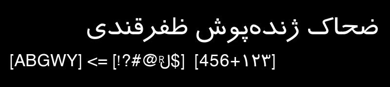 | XM ترافیک XM Traffic | سریف | ۲ وزن | [ ↩](#xm-traffic) |
| 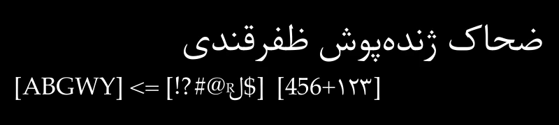 | XB کیهان XB Kayhan | سریف | ۲ وزن | [ ↩](#xb-kayhan) |
| 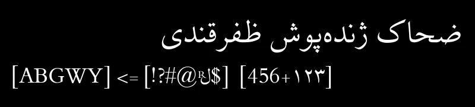 | XB نیلوفر XB Niloofar | سریف | ۲ وزن | [ ↩](#xb-niloofar) |
| 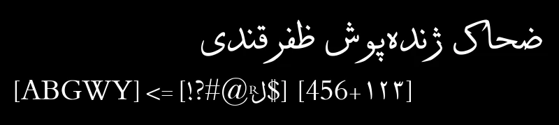 | XB سولس XB Sols | سریف | ۲ وزن | [ ↩](#xb-sols) |
| 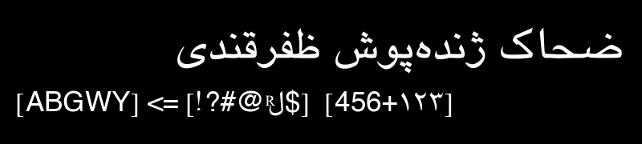 | XB یاقوت XB Yagut | سریف | ۲ وزن | [ ↩](#xb-yagut) |
| 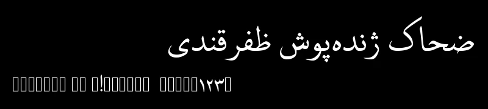 | نون Noon | سریف | ۱ وزن | [ ↩](#noon) |
| 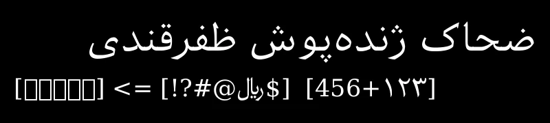 | ایرانیان سریف Iranian Serif | سریف | ۱ وزن | [ ↩](#iranian-serif) |
|  | میخک Mikhak | صمیمی | متغیر | [ ↩](#mikhak) |
|  | تنها Tanha | صمیمی | ۱ وزن | [ ↩](#tanha) |
|  | XP پاچ XP Paatch | صمیمی | ۲ وزن | [ ↩](#xp-paatch) |
|  | رویین Rooyin | پیکسلی | ۲ وزن | [ ↩](#rooyinfree) |
|  | سورنا Sorena | پیکسلی | ۱ وزن | [ ↩](#sorena) |
|  | نقطه Noqte | پیکسلی | ۱ وزن | [ ↩](#noqte) |
|  | هندجت Handjet | پیکسلی | متغیر | [ ↩](#handjet) |
|  | آریو Ario | عنوان | ۱ وزن | [ ↩](#ario) |
|  | لاله‌زار Lalezar | عنوان | ۱ وزن | [ ↩](#lalezar) |
|  | قدیم Ghadim | عنوان | ۱ وزن | [ ↩](#mim-bold) |
|  | جمهوری Jomhuria | عنوان | ۱ وزن | [ ↩](#jomhuria) |
|  | XB تیتر XB Titre | عنوان | ۱ وزن | [ ↩](#xb-titre) |
|  | بدین دیسپلی Badeen Display | نمایشی | ۱ وزن | [ ↩](#badeen_display) |
|  | بلاکا Blaka | نمایشی | ۱ وزن | [ ↩](#blaka) |
|  | مرحی Marhey | نمایشی | متغیر | [ ↩](#marhey) |
|  | اوی Oi | نمایشی | ۱ وزن | [ ↩](#oi) |
|  | رکاس Rakkas | نمایشی | ۱ وزن | [ ↩](#rakkas) |
|  | ایران نستعلیق Iran Nastaliq | نستعلیق | ۱ وزن | [ ↩](#irannastaliq) |
|  | گلزار Gulzar | نستعلیق | ۱ وزن | [ ↩](#gulzar) |
|  | نوتو نستعلیق اردو Noto Nastaliq Urdu | نستعلیق | متغیر | [ ↩](#noto-nastaliq-urdu) |
|  | عوامی نستعلیق Awami Nastaliq | نستعلیق | ۵ وزن | [ ↩](#awami_nastaliq) |
|  | XP وستا XP Vosta | تزئینی | ۲ وزن | [ ↩](#xp-vosta) |
|  | فندوق Fandogh | تزئینی | ۱ وزن | [ ↩](#fandogh) |
|  | وایبز Vibes | تزئینی | ۱ وزن | [ ↩](#vibes) |

## [↑](#row-vazirmatn) وزیرمتن

**توضیحات:** فونت سنس‌سریف ساده و بسیار خوانا برای وب و اپلیکیشن‌ها. از سال ۱۳۹۴ با نام وزیر شروع شد و بعدها گسترش یافت؛ حروف لاتین آن از روبوتو گرفته شده است.

**طراح:** صابر راستی‌کردار

**سبک:** سنس

**مجوز:** OFL

**زبان‌ها:** عربی، کردی سورانی، فارسی، انگلیسی، پشتو، اویغوری، اردو

**وزن‌ها:** متغیر

**یادداشت:** نسخهٔ توسعه‌یافته و جانشین فونت وزیر

[منبع](https://github.com/rastikerdar/vazirmatn) - [بارگیری](https://github.com/alr-rashidi/Awesome-Persian-Fonts/raw/refs/heads/main/data/font-files/vazirmatn-v33.003.zip)

---

## [↑](#row-aradvf) آراد

**توضیحات:** سنس‌سریف هندسی فارسی-عربی و جانشین مدرن شبنم. در ۱۰ وزن و چندین استایل نقطه طراحی شده و هم برای متن و هم تیتر مناسب است.

**طراح:** محمد درویشی

**سبک:** سنس

**مجوز:** OFL

**زبان‌ها:** عربی، کردی سورانی، فارسی، انگلیسی، اردو

**وزن‌ها:** متغیر

**محورهای متغیر:** `DSTY` (سبک نقطه‌ها) : ۱–۳

[منبع](https://github.com/MohamadDarvishi/Arad) - [بارگیری](https://github.com/alr-rashidi/Awesome-Persian-Fonts/raw/refs/heads/main/data/font-files/Arad_2.5.0.zip)

---

## [↑](#row-aq-normal-sans) نرمال سنس

**توضیحات:** سنس‌سریف نیمه‌رسمی بر پایهٔ وزیر و استعداد. طراحی تمیز و متعادل که هم برای اسناد حرفه‌ای و هم رابط‌های مدرن مناسب است.

**طراح:** آزادقلم

**سبک:** سنس

**مجوز:** OFL

**زبان‌ها:** عربی، کردی سورانی، فارسی، انگلیسی

**وزن‌ها:** متغیر

[منبع](https://github.com/AzadQalam/normal-sans) - [بارگیری](https://github.com/alr-rashidi/Awesome-Persian-Fonts/raw/refs/heads/main/data/font-files/AQNormalSans-v1.0.0.zip)

---

## [↑](#row-samim) صمیم

**توضیحات:** سنس‌سریف دوستانه و نرم بر پایهٔ وزیر، با گوشه‌های گرد و ظاهری آرام. مناسب متن‌های بلند و رابط کاربری با خوانایی خوب روی صفحه.

**طراح:** صابر راستی‌کردار

**سبک:** سنس

**مجوز:** OFL

**زبان‌ها:** عربی، کردی سورانی، فارسی، انگلیسی

**وزن‌ها:** ۳ وزن (۴۰۰, ۵۰۰, ۷۰۰)

[منبع](https://github.com/rastikerdar/samim-font) - [بارگیری](https://github.com/alr-rashidi/Awesome-Persian-Fonts/raw/refs/heads/main/data/font-files/samim-font-v4.0.5.zip)

---

## [↑](#row-shabnam) شبنم

**توضیحات:** سنس‌سریف هندسی و نرم با الهام از یکان و بر پایهٔ وزیر. حروف تمیز و مدرن با حس ملایم و معاصر.

**طراح:** صابر راستی‌کردار

**سبک:** سنس

**مجوز:** OFL

**زبان‌ها:** عربی، کردی سورانی، فارسی، انگلیسی

**وزن‌ها:** ۲ وزن (۴۰۰, ۵۰۰)

[منبع](https://github.com/rastikerdar/shabnam-font) - [بارگیری](https://github.com/alr-rashidi/Awesome-Persian-Fonts/raw/refs/heads/main/data/font-files/shabnam-font-v5.0.1.zip)

---

## [↑](#row-estedad) استعداد

**توضیحات:** سنس‌سریف ساده، نرم و فشردهٔ عربی-لاتین با کنتراست کم. بهینه‌شده برای صفحه و وب

**طراح:** امین عابدی

**سبک:** سنس

**مجوز:** OFL

**زبان‌ها:** عربی، کردی سورانی، فارسی، انگلیسی، پشتو، سندی، اویغوری، اردو

**وزن‌ها:** متغیر

[منبع](https://github.com/aminabedi68/Estedad) - [بارگیری](https://github.com/alr-rashidi/Awesome-Persian-Fonts/raw/refs/heads/main/data/font-files/Estedad-v8.5.zip)

---

## [↑](#row-sepehr) سپهر

**توضیحات:** سنس‌سریف فارسی-عربی بر پایهٔ وزیر و DejaVu. حروف فارسی بازطراحی شده‌اند تا خوانایی بهتری داشته باشند و ساختار آشنا حفظ شود.

**طراح:** سعید رضایی

**سبک:** سنس

**مجوز:** OFL

**زبان‌ها:** عربی، فارسی، انگلیسی

**وزن‌ها:** ۵ وزن (۱۰۰, ۳۰۰, ۴۰۰, ۵۰۰, ۷۰۰)

[منبع](https://github.com/googlefonts/sepehr-fonts) - [بارگیری](https://github.com/alr-rashidi/Awesome-Persian-Fonts/raw/refs/heads/main/data/font-files/sepehr-fonts-main.zip)

---

## [↑](#row-sahel) ساحل

**توضیحات:** سنس‌سریف تمیز و همه‌کاره از صابر راستی‌کردار. مناسب هم برای متن و هم طراحی رابط کاربری.

**طراح:** صابر راستی‌کردار

**سبک:** سنس

**مجوز:** OFL

**زبان‌ها:** عربی، کردی سورانی، فارسی

**وزن‌ها:** متغیر

[منبع](https://github.com/rastikerdar/sahel-font) - [بارگیری](https://github.com/alr-rashidi/Awesome-Persian-Fonts/raw/refs/heads/main/data/font-files/sahel-font-v3.4.0.zip)

---

## [↑](#row-nahid) ناهید

**توضیحات:** سنس‌سریف بسیار خوانا بر پایهٔ وزیر. برای وضوح در محیط‌های مطالعهٔ دیجیتال طراحی شده است.

**طراح:** صابر راستی‌کردار

**سبک:** سنس

**مجوز:** BVL

**زبان‌ها:** عربی، فارسی، انگلیسی

**وزن‌ها:** ۱ وزن (۴۰۰)

[منبع](https://github.com/rastikerdar/nahid-font) - [بارگیری](https://github.com/alr-rashidi/Awesome-Persian-Fonts/raw/refs/heads/main/data/font-files/nahid-font-v0.3.0.zip)

---

## [↑](#row-xm-yekan) XM یکان

**توضیحات:** سنس‌سریف کلاسیک فارسی در سبک یکان. فرم‌های هندسی ساده که سال‌ها در تایپوگرافی فارسی محبوب بوده است.

**طراح:** بهنام

**سبک:** سنس

**مجوز:** GPL

**زبان‌ها:** عربی، فارسی، انگلیسی

**وزن‌ها:** ۱ وزن (۴۰۰)

[منبع](https://fontlibrary.org/en/font/xm-yekan) - [بارگیری](https://github.com/alr-rashidi/Awesome-Persian-Fonts/raw/refs/heads/main/data/font-files/xm-yekan.zip)

---

## [↑](#row-elham) الهام

**توضیحات:** فونت فارسی هندسی و مناسب عنوان است که ظاهری خوانا و مدرن دارد.

**طراح:** شرکت فارسی‌وب شریف

**سبک:** سنس

**مجوز:** GPL

**زبان‌ها:** عربی، فارسی

**وزن‌ها:** ۱ وزن (۴۰۰)

[منبع](github.com/behnam/fonts-farsiweb) - [بارگیری](https://github.com/alr-rashidi/Awesome-Persian-Fonts/raw/refs/heads/main/data/font-files/elham.ttf)

---

## [↑](#row-ganjnamehsans) گنجنامه

**توضیحات:** سنس‌سریف مونولاین مدرن فارسی با ضخامت یکنواخت و تمیز. مناسب عناوین معاصر و متن‌های کوتاه.

**طراح:** محمد صالح سوزنچی

**سبک:** سنس

**مجوز:** OFL

**زبان‌ها:** عربی، فارسی

**وزن‌ها:** ۱ وزن (۴۰۰)

[منبع](https://github.com/font-store/GanjnamehFont) - [بارگیری](https://github.com/alr-rashidi/Awesome-Persian-Fonts/raw/refs/heads/main/data/font-files/ganjnameh.0.0.4.zip)

---

## [↑](#row-behdad) بهداد

**توضیحات:** سنس‌سریف مونولاین دوستانهٔ فارسی با شخصیت نرم و صمیمی. برای ارتباطات گرم و غیررسمی طراحی شده است.

**طراح:** محمد صالح سوزنچی

**سبک:** سنس

**مجوز:** OFL

**زبان‌ها:** عربی، فارسی

**وزن‌ها:** ۱ وزن (۴۰۰)

[منبع](https://github.com/font-store/BehdadFont) - [بارگیری](https://github.com/alr-rashidi/Awesome-Persian-Fonts/raw/refs/heads/main/data/font-files/Behdad-1.0.0.zip)

---

## [↑](#row-koodak) کودک

**توضیحات:** قلم گرد و دوستانهٔ فارسی با شخصیت نرم و کودکانه. مناسب مطالب آموزشی و طراحی‌های سبک و شاد.

**طراح:** شرکت فارسی‌وب شریف

**سبک:** سنس

**مجوز:** BVL

**زبان‌ها:** عربی، فارسی

**وزن‌ها:** ۱ وزن (۴۰۰)

[منبع](https://fontlibrary.org/en/font/koodak) - [بارگیری](https://github.com/alr-rashidi/Awesome-Persian-Fonts/raw/refs/heads/main/data/font-files/koodak.zip)

---

## [↑](#row-shahab) شهاب

**توضیحات:** سنس‌سریف مونولاین مدرن فارسی با ظاهر تمیز و معاصر. مناسب عناوین و برندینگ مدرن.

**طراح:** محمد صالح سوزنچی

**سبک:** سنس

**مجوز:** OFL

**زبان‌ها:** عربی، فارسی

**وزن‌ها:** ۱ وزن (۴۰۰)

[منبع](https://github.com/font-store/ShahabFont) - [بارگیری](https://github.com/alr-rashidi/Awesome-Persian-Fonts/raw/refs/heads/main/data/font-files/shahab.0.0.2.zip)

---

## [↑](#row-iranian-sans) ایرانیان سنس

**توضیحات:** سنس‌سریف آزاد و کاربردی فارسی با خوانایی خوب. نسخهٔ بهینه‌شده برای صفحه (ایران‌سنس‌زد) نیز برای وضوح پایین موجود است.

**طراح:** هومن مهر، هادی نوید،

**سبک:** سنس

**مجوز:** BVL

**زبان‌ها:** عربی، فارسی

**وزن‌ها:** ۲ وزن (۴۰۰, ۸۰۰)

[منبع](https://fontlibrary.org/en/font/iranian-sans) - [بارگیری](https://github.com/alr-rashidi/Awesome-Persian-Fonts/raw/refs/heads/main/data/font-files/iranian-sans.zip)

---

## [↑](#row-lemonada) لمونادا

**توضیحات:** سنس‌سریف گرد و دوستانهٔ عربی-لاتین که به‌صورت متغیر از Light تا Bold عرضه می‌شود.

**طراح:** محمد جابر

**سبک:** سنس

**مجوز:** OFL

**زبان‌ها:** عربی، فارسی، انگلیسی، اردو

**وزن‌ها:** متغیر

**یادداشت:** عدد ۴ در این فونت به زبان عربی می‌باشد

[منبع](https://github.com/Gue3bara/Lemonada) - [بارگیری](https://github.com/alr-rashidi/Awesome-Persian-Fonts/raw/refs/heads/main/data/font-files/Lemonada.zip)

---

## [↑](#row-alan_sans) الن سنس

**توضیحات:** گروتسک مدرن با طیف گستردهٔ وزن و فرم‌های هندسی تمیز. فقط از الفبای لاتین پشتیبانی می‌کند.

**طراح:** آلپ کاراتپه

**سبک:** سنس

**مجوز:** OFL

**زبان‌ها:** عربی، فارسی، انگلیسی، اردو

**وزن‌ها:** متغیر

[منبع](https://typeface.alan.com/) - [بارگیری](https://github.com/alr-rashidi/Awesome-Persian-Fonts/raw/refs/heads/main/data/font-files/Alan_Sans.zip)

---

## [↑](#row-almarai) المراعی

**توضیحات:** سنس‌سریف ساده و کاربردی عربی با چهار وزن؛ مناسب متن و رابط کاربری.

**طراح:** بوتروس

**سبک:** سنس

**مجوز:** OFL

**زبان‌ها:** عربی، فارسی، انگلیسی، اردو

**وزن‌ها:** ۴ وزن (۳۰۰, ۴۰۰, ۷۰۰, ۸۰۰)

[منبع](https://github.com/google/fonts/tree/main/ofl/almarai) - [بارگیری](https://github.com/alr-rashidi/Awesome-Persian-Fonts/raw/refs/heads/main/data/font-files/Almarai.zip)

---

## [↑](#row-changa) چنگا

**توضیحات:** سنس‌سریف نیمه‌فشردهٔ عربی-لاتین با طیف گستردهٔ وزن؛ هم برای تیتر و هم متن.

**طراح:** ادواردو تونی

**سبک:** سنس

**مجوز:** OFL

**زبان‌ها:** عربی، فارسی، انگلیسی، اردو

**وزن‌ها:** متغیر

[منبع](http://www.tipo.net.ar) - [بارگیری](https://github.com/alr-rashidi/Awesome-Persian-Fonts/raw/refs/heads/main/data/font-files/Changa.zip)

---

## [↑](#row-el-messiri) المسیری

**توضیحات:** سنس‌سریف عربی-لاتین با لحنی خوشنویسانه؛ حروف لاتین و سیریلیک با همکاری طراحان دیگر توسعه یافته‌اند.

**طراح:** محمد جابر

**سبک:** سنس

**مجوز:** OFL

**زبان‌ها:** عربی، فارسی، انگلیسی، اردو

**وزن‌ها:** متغیر

[منبع](https://github.com/Gue3bara/El-Messiri) - [بارگیری](https://github.com/alr-rashidi/Awesome-Persian-Fonts/raw/refs/heads/main/data/font-files/El_Messiri.zip)

---

## [↑](#row-harmattan) هارماتان

**توضیحات:** فونت عربی-لاتین از سازمان SIL برای زبان‌های آفریقای غربی؛ خوانا در اندازه‌های کوچک.

**طراح:** سازمان SIL

**سبک:** سنس

**مجوز:** OFL

**زبان‌ها:** عربی، کردی سورانی، فارسی، انگلیسی، پشتو، سندی، اویغوری، اردو

**وزن‌ها:** ۴ وزن (۳۰۰, ۵۰۰, ۶۰۰, ۷۰۰)

[منبع](https://software.sil.org/harmattan/) - [بارگیری](https://github.com/alr-rashidi/Awesome-Persian-Fonts/raw/refs/heads/main/data/font-files/Harmattan.zip)

---

## [↑](#row-alexandria) اسکندریه

**توضیحات:** فونتی سنس مدرن عربی-لاتین با ساختاری هندسی و تناسباتی متعادل. بخش لاتین آن از مونتسرات الهام گرفته.

**طراح:** محمد جابر

**سبک:** سنس

**مجوز:** OFL

**زبان‌ها:** عربی، فارسی، انگلیسی، اردو

**وزن‌ها:** متغیر

[منبع](https://github.com/Gue3bara/Alexandria) - [بارگیری](https://github.com/alr-rashidi/Awesome-Persian-Fonts/raw/refs/heads/main/data/font-files/Alexandria.zip)

---

## [↑](#row-cairo) قاهره

**توضیحات:** فونت سنس معاصر عربی-لاتین با الهام از خط کوفی و خوانایی بسیار خوب.

**طراح:** محمد جابر

**سبک:** سنس

**مجوز:** OFL

**زبان‌ها:** عربی، فارسی، انگلیسی، اردو

**وزن‌ها:** متغیر

[منبع](https://github.com/Gue3bara/Cairo) - [بارگیری](https://github.com/alr-rashidi/Awesome-Persian-Fonts/raw/refs/heads/main/data/font-files/Cairo.zip)

---

## [↑](#row-reem_kufi) ریم کوفی

**توضیحات:** فونت کوفی مدرن بر اساس مدل‌های اولیه مصحفی و فاطمی، ترکیبی از خوشنویسی کلاسیک عربی با تناسبات معاصر. عمدتاً برای عناوین و کاربردهای نمایشی طراحی شده است.

**طراح:** خالد حسنی، سانتیاگو اوروزکو

**سبک:** سنس

**مجوز:** OFL

**زبان‌ها:** عربی، کردی سورانی، فارسی، انگلیسی، اردو

**وزن‌ها:** متغیر

[منبع](https://github.com/alif-type/reem-kufi) - [بارگیری](https://github.com/alr-rashidi/Awesome-Persian-Fonts/raw/refs/heads/main/data/font-files/Reem_Kufi.zip)

---

## [↑](#row-vazir-code) وزیرکد

**توضیحات:** فونت تک‌فاصلهٔ فارسی بر پایهٔ وزیر، مخصوص کدنویسی و متون فنی. عرض یکسان حروف برای خوانایی بهتر در کد.

**طراح:** صابر راستی‌کردار

**سبک:** تک‌فاصله

**مجوز:** BVL

**زبان‌ها:** عربی، فارسی، انگلیسی

**وزن‌ها:** ۱ وزن (۴۰۰)

[منبع](https://github.com/rastikerdar/vazir-code-font) - [بارگیری](https://github.com/alr-rashidi/Awesome-Persian-Fonts/raw/refs/heads/main/data/font-files/vazir-code-font-v1.1.2.zip)

---

## [↑](#row-vira) ویرا

**توضیحات:** فونت تک‌فاصلهٔ ترکیبی از Fira Code و وزیرکد با پشتیبانی از لیگچر. ایده‌آل برای برنامه‌نویسی با هر دو خط لاتین و فارسی.

**طراح:** سینا عمرانی

**سبک:** تک‌فاصله

**مجوز:** OFL

**زبان‌ها:** عربی، فارسی، انگلیسی

**وزن‌ها:** ۱ وزن (۴۰۰)

[منبع](https://github.com/huzwares/Vira) - [بارگیری](https://github.com/alr-rashidi/Awesome-Persian-Fonts/raw/refs/heads/main/data/font-files/vira.zip)

---

## [↑](#row-zira-code) زیراکد

**توضیحات:** فونت تک‌فاصلهٔ ترکیبی از Fira Code و وزیرکد با پشتیبانی از لیگچر. ایده‌آل برای برنامه‌نویسی با هر دو خط لاتین و فارسی.

**طراح:** کیامازی

**سبک:** تک‌فاصله

**مجوز:** OFL

**زبان‌ها:** عربی، کردی سورانی، فارسی، انگلیسی، پشتو، سندی، اویغوری، اردو

**وزن‌ها:** ۱ وزن (۴۰۰)

[منبع](https://github.com/kiamazi/zira-code-font) - [بارگیری](https://github.com/alr-rashidi/Awesome-Persian-Fonts/raw/refs/heads/main/data/font-files/zira-code-font-v2.0.0.zip)

---

## [↑](#row-amiri) امیری

**توضیحات:** احیای کلاسیک نسخ برای تایپوگرافی کتاب‌های باکیفیت. زیبایی خوشنویسی سنتی عربی را با دقت دیجیتال مدرن ترکیب می‌کند.

**طراح:** خالد حسنی

**سبک:** سریف

**مجوز:** OFL

**زبان‌ها:** عربی، کردی سورانی، فارسی، انگلیسی، پشتو، سندی، اویغوری، اردو

**وزن‌ها:** ۲ وزن (۴۰۰, ۷۰۰)

[منبع](https://github.com/aliftype/amiri) - [بارگیری](https://github.com/alr-rashidi/Awesome-Persian-Fonts/raw/refs/heads/main/data/font-files/Amiri-1.003.zip)

---

## [↑](#row-parastoo) پرستو

**توضیحات:** سریف فارسی الهام‌گرفته از خط نسخ. شخصیتی سنتی اما خوانا دارد و برای متون ادبی و رسمی مناسب است.

**طراح:** صابر راستی‌کردار

**سبک:** سریف

**مجوز:** OFL

**زبان‌ها:** عربی، کردی سورانی، فارسی، انگلیسی

**وزن‌ها:** ۲ وزن (۴۰۰, ۷۰۰)

[منبع](https://github.com/rastikerdar/parastoo-font) - [بارگیری](https://github.com/alr-rashidi/Awesome-Persian-Fonts/raw/refs/heads/main/data/font-files/parastoo-font-v2.0.1.zip)

---

## [↑](#row-gandom) گندم

**توضیحات:** سریف فارسی بر پایهٔ سنت نسخ. طراحی نرم و دوستانه که برای متون طولانی مناسب است.

**طراح:** صابر راستی‌کردار

**سبک:** سریف

**مجوز:** OFL

**زبان‌ها:** عربی، فارسی، انگلیسی

**وزن‌ها:** ۱ وزن (۴۰۰)

[منبع](https://github.com/rastikerdar/gandom-font) - [بارگیری](https://github.com/alr-rashidi/Awesome-Persian-Fonts/raw/refs/heads/main/data/font-files/gandom-font-v0.8.zip)

---

## [↑](#row-mirza) میرزا

**توضیحات:** فونت نمایشی نستعلیق معاصر. ظرافت نستعلیق سنتی را حفظ می‌کند و برای استفادهٔ دیجیتال بهینه‌سازی شده است.

**طراح:** کورش بیگ‌پور

**سبک:** سریف

**مجوز:** OFL

**زبان‌ها:** عربی، کردی سورانی، فارسی، انگلیسی، پشتو، سندی، اویغوری، اردو

**وزن‌ها:** ۴ وزن (۴۰۰, ۵۰۰, ۶۰۰, ۷۰۰)

[منبع](https://github.com/Tarobish/Mirza) - [بارگیری](https://github.com/alr-rashidi/Awesome-Persian-Fonts/raw/refs/heads/main/data/font-files/Mirza.zip)

---

## [↑](#row-katibeh) کتیبه

**توضیحات:** فونت نمایشی ترکیبی از نسخ و ثلث. ضخیم و تزئینی، ایده‌آل برای عناوین و متون تشریفاتی.

**طراح:** کورش بیگ‌پور

**سبک:** سریف

**مجوز:** OFL

**زبان‌ها:** عربی، کردی سورانی، فارسی، انگلیسی، پشتو، سندی، اویغوری، اردو

**وزن‌ها:** ۱ وزن (۴۰۰)

[منبع](https://github.com/Tarobish/Katibeh) - [بارگیری](https://github.com/alr-rashidi/Awesome-Persian-Fonts/raw/refs/heads/main/data/font-files/Katibeh-Regular.ttf)

---

## [↑](#row-nika) نیکا

**توضیحات:** سریف فارسی در سبک نسخ کلاسیک. تناسبات سنتی با حروف واضح برای استفادهٔ رسمی و ادبی.

**طراح:** محمد صالح سوزنچی

**سبک:** سریف

**مجوز:** OFL

**زبان‌ها:** عربی، فارسی

**وزن‌ها:** ۱ وزن (۴۰۰)

[منبع](https://github.com/font-store/NikaFont) - [بارگیری](https://github.com/alr-rashidi/Awesome-Persian-Fonts/raw/refs/heads/main/data/font-files/nika.v1.0.0.zip)

---

## [↑](#row-farbod) فربد

**توضیحات:** سریف فارسی الهام‌گرفته از نسخ رسمی. ساخت‌یافته و شیک، مناسب اسناد رسمی و مواد چاپی.

**طراح:** محمد صالح سوزنچی

**سبک:** سریف

**مجوز:** OFL

**زبان‌ها:** عربی، فارسی

**وزن‌ها:** ۱ وزن (۴۰۰)

[منبع](https://github.com/font-store/FarbodFont) - [بارگیری](https://github.com/alr-rashidi/Awesome-Persian-Fonts/raw/refs/heads/main/data/font-files/Farbod-3.2.5.zip)

---

## [↑](#row-freefarsi) فری‌فارسی

**توضیحات:** قلم سریف آزاد یونیکد فارسی با پشتیبانی گسترده از زبان‌ها. انتخاب کاربردی برای متن‌های عمومی و اسناد چندزبانه.

**طراح:** عباس ایزد

**سبک:** سریف

**مجوز:** Apache

**زبان‌ها:** عربی، فارسی، انگلیسی

**وزن‌ها:** ۲ وزن (۴۰۰, ۷۰۰)

[منبع](https://fontlibrary.org/en/font/freefarsi) - [بارگیری](https://github.com/alr-rashidi/Awesome-Persian-Fonts/raw/refs/heads/main/data/font-files/freefarsi.zip)

---

## [↑](#row-homa) هما

**توضیحات:** سریف کلاسیک فارسی با تناسبات سنتی. انتخاب دیرین برای تایپوگرافی رسمی و ادبی فارسی.

**طراح:** شرکت فارسی‌وب شریف

**سبک:** سریف

**مجوز:** GPL

**زبان‌ها:** عربی، فارسی

**وزن‌ها:** ۱ وزن (۴۰۰)

[منبع](https://github.com/behnam/fonts-farsiweb) - [بارگیری](https://github.com/alr-rashidi/Awesome-Persian-Fonts/raw/refs/heads/main/data/font-files/homa.ttf)

---

## [↑](#row-pfont) قلم آزاد

**توضیحات:** قلم سریف خوانا و استاندارد فارسی. برای وضوح در زبان‌های مختلف منطقه طراحی شده است.

**طراح:** دامون خانجان‌زاده

**سبک:** سریف

**مجوز:** OFL

**زبان‌ها:** عربی، کردی سورانی، فارسی، پشتو، اویغوری، اردو

**وزن‌ها:** ۱ وزن (۴۰۰)

[منبع](https://github.com/pfont/pfont) - [بارگیری](https://github.com/alr-rashidi/Awesome-Persian-Fonts/raw/refs/heads/main/data/font-files/pfont.zip)

---

## [↑](#row-nazli) نازلی

**توضیحات:** سریف فارسی بر پایهٔ سبک کلاسیک نازنین. حروف نرم و شیک مناسب متون ادبی و رسمی.

**طراح:** شرکت شریف فارسی‌وب

**سبک:** سریف

**مجوز:** GPL

**زبان‌ها:** عربی، فارسی، انگلیسی

**وزن‌ها:** ۲ وزن (۴۰۰, ۷۰۰)

[منبع](https://fontlibrary.org/en/font/nazli) - [بارگیری](https://github.com/alr-rashidi/Awesome-Persian-Fonts/raw/refs/heads/main/data/font-files/nazli.zip)

---

## [↑](#row-roya) رویا

**توضیحات:** سریف کلاسیک فارسی با تناسبات متعادل. محبوب برای اسناد رسمی و کارهای چاپی سنتی.

**طراح:** شرکت شریف فارسی‌وب

**سبک:** سریف

**مجوز:** BVL

**زبان‌ها:** عربی، فارسی

**وزن‌ها:** ۲ وزن (۴۰۰, ۷۰۰)

[منبع](https://fontlibrary.org/en/font/roya) - [بارگیری](https://github.com/alr-rashidi/Awesome-Persian-Fonts/raw/refs/heads/main/data/font-files/roya.zip)

---

## [↑](#row-lateef) لطیف

**توضیحات:** فونت عربی-لاتین از سازمان SIL در سبک نسخ؛ در اصل برای زبان سندی طراحی شده است.

**طراح:** سازمان SIL

**سبک:** سریف

**مجوز:** OFL

**زبان‌ها:** عربی، کردی سورانی، فارسی، انگلیسی، پشتو، سندی، اویغوری، اردو

**وزن‌ها:** ۷ وزن (۲۰۰, ۳۰۰, ۴۰۰, ۵۰۰, ۶۰۰, ۷۰۰, ۸۰۰)

[منبع](https://software.sil.org/lateef/) - [بارگیری](https://github.com/alr-rashidi/Awesome-Persian-Fonts/raw/refs/heads/main/data/font-files/Lateef.zip)

---

## [↑](#row-aref_ruqaa) عارف رقعه

**توضیحات:** فونت عربی که جوهر سبک خوشنویسی کلاسیک رقعه را به تصویر می‌کشد. در وزن‌های معمولی و ضخیم موجود است و نسخه رنگی جوهر نیز دارد.

**طراح:** عبدالله عارف، خالد حسنی

**سبک:** سریف

**مجوز:** OFL

**زبان‌ها:** عربی، کردی سورانی، فارسی، انگلیسی، اردو

**وزن‌ها:** ۲ وزن (۴۰۰, ۷۰۰)

[منبع](https://github.com/alif-type/aref-ruqaa) - [بارگیری](https://github.com/alr-rashidi/Awesome-Persian-Fonts/raw/refs/heads/main/data/font-files/Aref_Ruqaa.zip)

---

## [↑](#row-scheherazade_new) شهرزاد نیو

**توضیحات:** فونت عربی سنتی به سبک نسخ با پوشش گسترده یونیکد. از ویژگی‌های Graphite و OpenType برای رندر پیچیده خط عربی پشتیبانی می‌کند. مناسب برای متن اصلی و کارهای علمی.

**طراح:** سیل اینترنشنال

**سبک:** سریف

**مجوز:** OFL

**زبان‌ها:** عربی، کردی سورانی، فارسی، انگلیسی، پشتو، سندی، اویغوری، اردو

**وزن‌ها:** ۴ وزن (۴۰۰, ۵۰۰, ۶۰۰, ۷۰۰)

[منبع](https://software.sil.org/scheherazade) - [بارگیری](https://github.com/alr-rashidi/Awesome-Persian-Fonts/raw/refs/heads/main/data/font-files/Scheherazade_New.zip)

---

## [↑](#row-markazi_text) مرکزی تکست

**توضیحات:** فونت متن معاصر با کنتراست متوسط، الهام‌گرفته از فونت مرکزی تیم هالووی. طراحی‌شده برای خوانایی بالا در خطوط عربی و لاتین برای چاپ و صفحه نمایش.

**طراح:** برنا ایزدپناه، فیونا راس، فلوریان رانگه

**سبک:** سریف

**مجوز:** OFL

**زبان‌ها:** عربی، فارسی، انگلیسی، اردو

**وزن‌ها:** متغیر

[منبع](https://github.com/BornaIz/markazitext) - [بارگیری](https://github.com/alr-rashidi/Awesome-Persian-Fonts/raw/refs/heads/main/data/font-files/Markazi_Text.zip)

---

## [↑](#row-xb-yas) XB یاس

**توضیحات:** سریف کلاسیک فارسی از سری X. طراحی سنتی با پشتیبانی خوب از زبان‌های منطقه‌ای.

**طراح:** بهنام

**سبک:** سریف

**مجوز:** GPL

**زبان‌ها:** عربی، کردی سورانی، فارسی، انگلیسی، پشتو، اویغوری، اردو

**وزن‌ها:** ۲ وزن (۴۰۰, ۷۰۰)

[منبع](https://fontlibrary.org/en/font/xb-yas) - [بارگیری](https://github.com/alr-rashidi/Awesome-Persian-Fonts/raw/refs/heads/main/data/font-files/Yas.zip)

---

## [↑](#row-xb-riyaz) XB ریاض

**توضیحات:** سریف کلاسیک فارسی از سری X. ساخت‌یافته و رسمی، مناسب مطالب آموزشی و رسمی.

**طراح:** بهنام

**سبک:** سریف

**مجوز:** GPL

**زبان‌ها:** عربی، کردی سورانی، فارسی، انگلیسی، پشتو، اویغوری، اردو

**وزن‌ها:** ۲ وزن (۴۰۰, ۷۰۰)

[منبع](https://fontlibrary.org/en/font/xb-riyaz) - [بارگیری](https://github.com/alr-rashidi/Awesome-Persian-Fonts/raw/refs/heads/main/data/font-files/Riyaz.zip)

---

## [↑](#row-xb-zar) XB زر

**توضیحات:** سریف کلاسیک فارسی از سری X. فرم‌های سنتی شیک با پوشش گستردهٔ زبانی.

**طراح:** بهنام

**سبک:** سریف

**مجوز:** OFL

**زبان‌ها:** عربی، کردی سورانی، فارسی، انگلیسی، پشتو، اویغوری، اردو

**وزن‌ها:** ۲ وزن (۴۰۰, ۷۰۰)

[منبع](https://fontlibrary.org/en/font/xb-zar) - [بارگیری](https://github.com/alr-rashidi/Awesome-Persian-Fonts/raw/refs/heads/main/data/font-files/Zar.zip)

---

## [↑](#row-xb-shafigh) XB شفیق

**توضیحات:** سریف کلاسیک فارسی از سری X. طراحی سنتی با گونه‌های موجود برای کردی و ازبکی.

**طراح:** بهنام

**سبک:** سریف

**مجوز:** GPL

**زبان‌ها:** عربی، کردی سورانی، فارسی، انگلیسی، پشتو، اویغوری، اردو

**وزن‌ها:** ۲ وزن (۴۰۰, ۷۰۰)

[منبع](https://fontlibrary.org/en/font/xb-shafigh) - [بارگیری](https://github.com/alr-rashidi/Awesome-Persian-Fonts/raw/refs/heads/main/data/font-files/Shafigh.zip)

---

## [↑](#row-xb-shafigh-kurd) XB شفیق کرد

**توضیحات:** گونهٔ کردی سریف کلاسیک شفیق. حروف تطبیق‌یافته برای پشتیبانی بهتر از نوشتار کردی.

**طراح:** بهنام

**سبک:** سریف

**مجوز:** GPL

**زبان‌ها:** عربی، کردی سورانی، فارسی، انگلیسی، پشتو، اویغوری، اردو

**وزن‌ها:** ۲ وزن (۴۰۰, ۷۰۰)

[منبع](https://fontlibrary.org/en/font/xb-shafigh-kurd) - [بارگیری](<https://github.com/alr-rashidi/Awesome-Persian-Fonts/raw/refs/heads/main/data/font-files/Shafigh Kurd.zip>)

---

## [↑](#row-xb-shafigh-uzbek) XB شفیق ازبک

**توضیحات:** گونهٔ ازبکی سریف کلاسیک شفیق. برای قراردادهای نوشتاری ازبکی تنظیم شده و شخصیت اصلی حفظ شده است.

**طراح:** بهنام

**سبک:** سریف

**مجوز:** GPL

**زبان‌ها:** عربی، کردی سورانی، فارسی، انگلیسی، پشتو، اویغوری، اردو

**وزن‌ها:** ۲ وزن (۴۰۰, ۷۰۰)

[منبع](https://fontlibrary.org/en/font/xb-shafigh-uzbek) - [بارگیری](<https://github.com/alr-rashidi/Awesome-Persian-Fonts/raw/refs/heads/main/data/font-files/Shafigh Uzbek.zip>)

---

## [↑](#row-xm-traffic) XM ترافیک

**توضیحات:** سریف کلاسیک فارسی طراحی‌شده برای خوانایی واضح. اغلب در تابلوها و مطالب اطلاع‌رسانی استفاده می‌شود.

**طراح:** بهنام

**سبک:** سریف

**مجوز:** OFL

**زبان‌ها:** عربی، کردی سورانی، فارسی، انگلیسی، پشتو، اویغوری، اردو

**وزن‌ها:** ۲ وزن (۴۰۰, ۷۰۰)

[منبع](https://fontlibrary.org/en/font/xm-traffic) - [بارگیری](https://github.com/alr-rashidi/Awesome-Persian-Fonts/raw/refs/heads/main/data/font-files/Traffic.zip)

---

## [↑](#row-xb-kayhan) XB کیهان

**توضیحات:** نسخهٔ فشردهٔ سریف کلاسیک کیهان. فشرده و کارآمد در حالی که شخصیت سنتی حفظ شده است.

**طراح:** بهنام

**سبک:** سریف

**مجوز:** OFL

**زبان‌ها:** عربی، کردی سورانی، فارسی، انگلیسی، پشتو، اویغوری، اردو

**وزن‌ها:** ۲ وزن (۴۰۰, ۷۰۰)

[منبع](https://fontlibrary.org/en/font/xb-kayhan-minified) - [بارگیری](https://github.com/alr-rashidi/Awesome-Persian-Fonts/raw/refs/heads/main/data/font-files/xb-kayhan-minified.zip)

---

## [↑](#row-xb-niloofar) XB نیلوفر

**توضیحات:** سریف کلاسیک فارسی از سری X. فرم‌های نرم و روان الهام‌گرفته از خوشنویسی سنتی.

**طراح:** بهنام

**سبک:** سریف

**مجوز:** OFL

**زبان‌ها:** عربی، کردی سورانی، فارسی، انگلیسی، پشتو، اویغوری، اردو

**وزن‌ها:** ۲ وزن (۴۰۰, ۷۰۰)

[منبع](https://fontlibrary.org/en/font/xb-niloofar) - [بارگیری](https://github.com/alr-rashidi/Awesome-Persian-Fonts/raw/refs/heads/main/data/font-files/Niloofar.zip)

---

## [↑](#row-xb-sols) XB سولس

**توضیحات:** سریف کلاسیک فارسی از سری X. واضح و با تناسبات خوب برای استفاده در متن‌های عمومی.

**طراح:** بهنام

**سبک:** سریف

**مجوز:** GPL

**زبان‌ها:** عربی، کردی سورانی، فارسی، انگلیسی، پشتو، اویغوری، اردو

**وزن‌ها:** ۲ وزن (۴۰۰, ۷۰۰)

[منبع](https://fontlibrary.org/en/font/xb-sols) - [بارگیری](https://github.com/alr-rashidi/Awesome-Persian-Fonts/raw/refs/heads/main/data/font-files/Sols.zip)

---

## [↑](#row-xb-yagut) XB یاقوت

**توضیحات:** سریف کلاسیک فارسی از سری X. طراحی سنتی ظریف مناسب کاربردهای رسمی و ادبی.

**طراح:** بهنام

**سبک:** سریف

**مجوز:** GPL

**زبان‌ها:** عربی، کردی سورانی، فارسی، انگلیسی، پشتو، اویغوری، اردو

**وزن‌ها:** ۲ وزن (۴۰۰, ۷۰۰)

[منبع](https://fontlibrary.org/en/font/xb-yagut) - [بارگیری](https://github.com/alr-rashidi/Awesome-Persian-Fonts/raw/refs/heads/main/data/font-files/Yagut.zip)

---

## [↑](#row-noon) نون

**توضیحات:** فونت نسخ تخصصی برای چاپ قرآن. توجه ویژه به تناسبات سنتی و قرارگیری علائم.

**طراح:** محمد صالح سوزنچی

**سبک:** سریف

**مجوز:** OFL

**زبان‌ها:** عربی، کردی سورانی، فارسی، پشتو، سندی، اویغوری، اردو

**وزن‌ها:** ۱ وزن (۴۰۰)

[منبع](https://github.com/font-store/NoonFont) - [بارگیری](https://github.com/alr-rashidi/Awesome-Persian-Fonts/raw/refs/heads/main/data/font-files/Noon-Regular.zip)

---

## [↑](#row-iranian-serif) ایرانیان سریف

**توضیحات:** قلم سریف آزاد فارسی با شخصیت سنتی. ساده و کاربردی برای استفادهٔ رسمی عمومی.

**طراح:** هومن مهر، هادی نوید،

**سبک:** سریف

**مجوز:** BVL

**زبان‌ها:** عربی، فارسی

**وزن‌ها:** ۱ وزن (۴۰۰)

[منبع](https://fontlibrary.org/en/font/iranian-serif) - [بارگیری](https://github.com/alr-rashidi/Awesome-Persian-Fonts/raw/refs/heads/main/data/font-files/iranian-serif.zip)

---

## [↑](#row-mikhak) میخک

**توضیحات:** قلم نیمه‌دست‌نویس و مونو-عرض فارسی با شخصیت دوستانه.

**طراح:** امین عابدی

**سبک:** صمیمی

**مجوز:** OFL

**زبان‌ها:** عربی، کردی سورانی، فارسی، انگلیسی، اردو

**وزن‌ها:** متغیر

[منبع](https://github.com/aminabedi68/Mikhak) - [بارگیری](https://github.com/alr-rashidi/Awesome-Persian-Fonts/raw/refs/heads/main/data/font-files/Mikhak-v3.4.zip)

---

## [↑](#row-tanha) تنها

**توضیحات:** قلم غیررسمی و دست‌نویس‌مانند فارسی. شخصیت نرم و شخصی ایده‌آل برای یادداشت‌های غیررسمی و طراحی‌های دوستانه.

**طراح:** صابر راستی‌کردار

**سبک:** صمیمی

**مجوز:** BVL

**زبان‌ها:** عربی، فارسی، انگلیسی

**وزن‌ها:** ۱ وزن (۴۰۰)

[منبع](https://github.com/rastikerdar/tanha-font) - [بارگیری](https://github.com/alr-rashidi/Awesome-Persian-Fonts/raw/refs/heads/main/data/font-files/tanha-font-v0.10.zip)

---

## [↑](#row-xp-paatch) XP پاچ

**توضیحات:** قلم غیررسمی فارسی با شخصیت متمایز و دوستانه. مناسب عناوین غیررسمی و پروژه‌های خلاقانه.

**طراح:** بهنام

**سبک:** صمیمی

**مجوز:** OFL

**زبان‌ها:** عربی، کردی سورانی، فارسی، انگلیسی، پشتو، اویغوری، اردو

**وزن‌ها:** ۲ وزن (۲۰۰, ۴۰۰)

[منبع](https://fontlibrary.org/en/font/xp-paatch) - [بارگیری](https://github.com/alr-rashidi/Awesome-Persian-Fonts/raw/refs/heads/main/data/font-files/xp-paatch.zip)

---

## [↑](#row-rooyinfree) رویین

**توضیحات:** قلم پیکسلی مدرن فارسی. شبکهٔ پیکسلی تمیز با تناسبات معاصر برای طراحی‌های دیجیتال و الهام‌گرفته از رترو.

**طراح:** محمد درویشی

**سبک:** پیکسلی

**مجوز:** OFL

**زبان‌ها:** عربی، کردی سورانی، فارسی، انگلیسی، اردو

**وزن‌ها:** ۲ وزن (۴۰۰, ۷۰۰)

[منبع](https://github.com/MohamadDarvishi/Rooyin) - [بارگیری](https://github.com/alr-rashidi/Awesome-Persian-Fonts/raw/refs/heads/main/data/font-files/Rooyin-Free.zip)

---

## [↑](#row-sorena) سورنا

**توضیحات:** قلم پیکسلی مینیمال فارسی در دو حالت Normal و Pixel. با توجه دقیق به قواعد شبکهٔ پیکسلی طراحی شده است.

**طراح:** محمد درویشی

**سبک:** پیکسلی

**مجوز:** OFL

**زبان‌ها:** عربی، کردی سورانی، فارسی، انگلیسی، اردو

**وزن‌ها:** ۱ وزن (۴۰۰)

**استایل‌ها:** Pixel

**یادداشت:** این فونت دو حالت Normal & Pixel دارد. حالت Pixel کاملاً بر اساس قواعد پیکسلی است. حالت Normal برای زیبایی بیشتر، بعضی موارد فونت به قواعد پیکسلی پایبند نیست.

[منبع](https://github.com/MohamadDarvishi/Sorena) - [بارگیری](https://github.com/alr-rashidi/Awesome-Persian-Fonts/raw/refs/heads/main/data/font-files/Sorena.zip)

---

## [↑](#row-noqte) نقطه

**توضیحات:** قلم پیکسلی مینیمال فارسی با شخصیت متمایز و فشرده. عالی برای اندازه‌های کوچک و زیبایی‌شناسی دیجیتال رترو.

**طراح:** مهدی صادقی

**سبک:** پیکسلی

**مجوز:** OFL

**زبان‌ها:** عربی، فارسی، انگلیسی

**وزن‌ها:** ۱ وزن (۴۰۰)

[منبع](https://github.com/mehdisadeghi/Noqte) - [بارگیری](https://github.com/alr-rashidi/Awesome-Persian-Fonts/raw/refs/heads/main/data/font-files/noqte.ttf)

---

## [↑](#row-handjet) هندجت

**توضیحات:** فونت پیکسلی متغیر با محورهای قابل‌تنظیم شکل و شبکهٔ عناصر؛ پشتیبانی از ده‌ها خط نوشتاری.

**طراح:** دیوید برزینا

**سبک:** پیکسلی

**مجوز:** OFL

**زبان‌ها:** عربی، فارسی، انگلیسی، اردو

**وزن‌ها:** متغیر

**محورهای متغیر:** `ELSH` (سبک پیکسل‌ها) : ۱–۱۶

[منبع](https://rosettatype.com/) - [بارگیری](https://github.com/alr-rashidi/Awesome-Persian-Fonts/raw/refs/heads/main/data/font-files/Handjet.zip)

---

## [↑](#row-ario) آریو

**توضیحات:** فونت نمایشی ضخیم بر پایهٔ استعداد. طراحی قوی و تأثیرگذار برای عناوین و استفاده در مقیاس بزرگ.

**طراح:** محمد درویشی

**سبک:** عنوان

**مجوز:** OFL

**زبان‌ها:** عربی، کردی سورانی، فارسی، انگلیسی، اردو

**وزن‌ها:** ۱ وزن (۴۰۰)

[منبع](https://github.com/MohamadDarvishi/Ario) - [بارگیری](https://github.com/alr-rashidi/Awesome-Persian-Fonts/raw/refs/heads/main/data/font-files/Ario_2.0.1.zip)

---

## [↑](#row-lalezar) لاله‌زار

**توضیحات:** فونت نمایشی ضخیم با الهام از پوسترهای قدیمی ایرانی. شخصیت قوی و تأثیر بصری بالا برای عناوین و برندینگ.

**طراح:** برنا ایزدپناه

**سبک:** عنوان

**مجوز:** OFL

**زبان‌ها:** عربی، فارسی، انگلیسی، اردو

**وزن‌ها:** ۱ وزن (۴۰۰)

[منبع](https://github.com/BornaIz/Lalezar) - [بارگیری](https://github.com/alr-rashidi/Awesome-Persian-Fonts/raw/refs/heads/main/data/font-files/Lalezar-Regular.ttf)

---

## [↑](#row-mim-bold) قدیم

**توضیحات:** فونتی شبیه به متن روزنامه‌های قدیمی ایرانی

**طراح:** مهدی روندی و مجتبی زند

**سبک:** عنوان

**مجوز:** OFL

**زبان‌ها:** عربی، کردی سورانی، فارسی، انگلیسی

**وزن‌ها:** ۱ وزن (۴۰۰)

[منبع](https://t.me/fonthacom) - [بارگیری](<https://github.com/alr-rashidi/Awesome-Persian-Fonts/raw/refs/heads/main/data/font-files/Ghadim Font.zip>)

---

## [↑](#row-jomhuria) جمهوری

**توضیحات:** فونت نمایشی ضخیم و بیانگر. برای عناوین قوی و ارتباطات بصری تأثیرگذار طراحی شده است.

**طراح:** کورش بیگ‌پور

**سبک:** عنوان

**مجوز:** OFL

**زبان‌ها:** عربی، کردی سورانی، فارسی، انگلیسی، پشتو، سندی، اویغوری، اردو

**وزن‌ها:** ۱ وزن (۴۰۰)

[منبع](https://github.com/Tarobish/Jomhuria) - [بارگیری](https://github.com/alr-rashidi/Awesome-Persian-Fonts/raw/refs/heads/main/data/font-files/Jomhuria-Regular.ttf)

---

## [↑](#row-xb-titre) XB تیتر

**توضیحات:** قلم نمایشی کلاسیک فارسی از سری X. به‌طور خاص برای عناوین و متن‌های بزرگ طراحی شده است.

**طراح:** بهنام

**سبک:** عنوان

**مجوز:** GPL

**زبان‌ها:** عربی، کردی سورانی، فارسی، انگلیسی، پشتو، اویغوری، اردو

**وزن‌ها:** ۱ وزن (۴۰۰)

[منبع](https://fontlibrary.org/en/font/xb-titre) - [بارگیری](https://github.com/alr-rashidi/Awesome-Persian-Fonts/raw/refs/heads/main/data/font-files/xb-titre.zip)

---

## [↑](#row-badeen_display) بدین دیسپلی

**توضیحات:** فونت نمایشی عربی با شخصیت ضخیم و پوستری؛ مناسب تیتر و برندینگ.

**طراح:** هانی الاسدی

**سبک:** نمایشی

**مجوز:** OFL

**زبان‌ها:** عربی، فارسی، انگلیسی، اردو

**وزن‌ها:** ۱ وزن (۴۰۰)

[منبع](https://github.com/haniadnansd/Badeen-Display) - [بارگیری](https://github.com/alr-rashidi/Awesome-Persian-Fonts/raw/refs/heads/main/data/font-files/Badeen_Display.zip)

---

## [↑](#row-blaka) بلاکا

**توضیحات:** فونت نمایشی ضخیم عربی با شخصیت قوی و متمایز؛ مناسب عناوین.

**طراح:** محمد جابر

**سبک:** نمایشی

**مجوز:** OFL

**زبان‌ها:** عربی، فارسی، انگلیسی، اردو

**وزن‌ها:** ۱ وزن (۴۰۰)

[منبع](https://github.com/Gue3bara/Blaka) - [بارگیری](https://github.com/alr-rashidi/Awesome-Persian-Fonts/raw/refs/heads/main/data/font-files/Blaka.zip)

---

## [↑](#row-marhey) مرحی

**توضیحات:** فونت نمایشی شاد و سرگرم‌کنندهٔ عربی با محور وزن متغیر.

**طراح:** نور سیامسی + بستان‌الا‌ارفین

**سبک:** نمایشی

**مجوز:** OFL

**زبان‌ها:** عربی، کردی سورانی، فارسی، انگلیسی، اردو

**وزن‌ها:** متغیر

[منبع](https://github.com/namelatype/Marhey) - [بارگیری](https://github.com/alr-rashidi/Awesome-Persian-Fonts/raw/refs/heads/main/data/font-files/Marhey.zip)

---

## [↑](#row-oi) اوی

**توضیحات:** فونت نمایشی فوق‌ضخیم عربی-لاتین با شخصیت قوی و نمایشی.

**طراح:** کوستاس بارتسوکاس

**سبک:** نمایشی

**مجوز:** OFL

**زبان‌ها:** عربی، فارسی، انگلیسی، اردو

**وزن‌ها:** ۱ وزن (۴۰۰)

[منبع](https://github.com/kosbarts/Oi) - [بارگیری](https://github.com/alr-rashidi/Awesome-Persian-Fonts/raw/refs/heads/main/data/font-files/Oi.zip)

---

## [↑](#row-rakkas) رکاس

**توضیحات:** فونت نمایشی تک‌وزن الهام‌گرفته از حروف رقعه روی پوسترهای فیلم مصری دهه ۱۹۵۰ و ۶۰. دارای جایگزین‌های متنی غنی که سیالیت خوشنویسی سنتی را تقلید می‌کند.

**طراح:** زینب آکای

**سبک:** نمایشی

**مجوز:** OFL

**زبان‌ها:** عربی، فارسی، انگلیسی، اردو

**وزن‌ها:** ۱ وزن (۴۰۰)

[منبع](https://github.com/zeynepakay/Rakkas) - [بارگیری](https://github.com/alr-rashidi/Awesome-Persian-Fonts/raw/refs/heads/main/data/font-files/Rakkas.zip)

---

## [↑](#row-irannastaliq) ایران نستعلیق

**توضیحات:** فونت نستعلیق کلاسیک برای فارسی و خطوط مرتبط. زیبایی روان خوشنویسی سنتی نستعلیق را به تصویر می‌کشد.

**طراح:** محمد صالح سوزنچی

**سبک:** نستعلیق

**مجوز:** OFL

**زبان‌ها:** عربی، کردی سورانی، فارسی، انگلیسی، پشتو، سندی، اویغوری، اردو

**وزن‌ها:** ۱ وزن (۴۰۰)

[منبع](https://github.com/font-store/font-IranNastaliq) - [بارگیری](https://github.com/alr-rashidi/Awesome-Persian-Fonts/raw/refs/heads/main/data/font-files/font-IranNastaliq-1.zip)

---

## [↑](#row-gulzar) گلزار

**توضیحات:** فونت نستعلیق که در اصل برای زبان اردو طراحی شده؛ مناسب شعر و متون ادبی.

**طراح:** برنا ایزدپناه

**سبک:** نستعلیق

**مجوز:** OFL

**زبان‌ها:** عربی، فارسی، انگلیسی، اردو

**وزن‌ها:** ۱ وزن (۴۰۰)

[منبع](https://gulzarfont.org/) - [بارگیری](https://github.com/alr-rashidi/Awesome-Persian-Fonts/raw/refs/heads/main/data/font-files/Gulzar.zip)

---

## [↑](#row-noto-nastaliq-urdu) نوتو نستعلیق اردو

**توضیحات:** فونت نستعلیق اردو از پروژهٔ نوتو گوگل.

**طراح:** پروژهٔ نوتو (گوگل)

**سبک:** نستعلیق

**مجوز:** OFL

**زبان‌ها:** عربی، فارسی، انگلیسی، پشتو، سندی، اردو

**وزن‌ها:** متغیر

[منبع](https://fonts.google.com/noto/specimen/Noto+Nastaliq+Urdu) - [بارگیری](https://github.com/alr-rashidi/Awesome-Persian-Fonts/raw/refs/heads/main/data/font-files/Noto_Nastaliq_Urdu.zip)

---

## [↑](#row-awami_nastaliq) عوامی نستعلیق

**توضیحات:** عوامی نستعلیق فونتی جامع به سبک خط نستعلیق است که توسط سازمان بین‌المللی سیل (SIL International) و عمدتاً به طراحی جاناتان کیو توسعه یافته است. این فونت زبان‌هایی مانند اردو، فارسی، پنجابی (شاه‌مکهی)، کردی سورانی، سرائیکی، سندی، بلوچی و عربی را پوشش می‌دهد و با به‌کارگیری قواعد هوشمند Graphite (و OpenType در نسخه‌های جدید)، لیگاچورهای پیچیده، کشیدگی‌های مورب و چیدمان عمودی حروف در خوشنویسی نستعلیق را به‌درستی بازنمایی می‌کند.

**طراح:** جاناتان کیو

**سبک:** نستعلیق

**مجوز:** OFL

**زبان‌ها:** عربی، کردی سورانی، فارسی، انگلیسی، پشتو، اویغوری، اردو

**وزن‌ها:** ۵ وزن (۴۰۰, ۵۰۰, ۶۰۰, ۷۰۰, ۸۰۰)

**یادداشت:** اعداد این فونت به زبان اردو می‌باشد

[منبع](https://github.com/silnrsi/font-awami) - [بارگیری](https://github.com/alr-rashidi/Awesome-Persian-Fonts/raw/refs/heads/main/data/font-files/Awami_Nastaliq.zip)

---

## [↑](#row-xp-vosta) XP وستا

**توضیحات:** قلم تزئینی فارسی با شخصیت متمایز و زینتی. مناسب عناوین و پروژه‌های طراحی خاص.

**طراح:** بهنام

**سبک:** تزئینی

**مجوز:** GPL

**زبان‌ها:** عربی، کردی سورانی، فارسی، انگلیسی، پشتو، اویغوری، اردو

**وزن‌ها:** ۲ وزن (۴۰۰, ۷۰۰)

[منبع](https://fontlibrary.org/en/font/xp-vosta) - [بارگیری](https://github.com/alr-rashidi/Awesome-Persian-Fonts/raw/refs/heads/main/data/font-files/Vosta.zip)

---

## [↑](#row-fandogh) فندوق

**توضیحات:** قلم فانتزی و تزئینی فارسی. طراحی بازیگوش و زینتی ایده‌آل برای کاربردهای خلاقانه و جشن.

**طراح:** امین عابدی

**سبک:** تزئینی

**مجوز:** OFL

**زبان‌ها:** عربی، فارسی

**وزن‌ها:** ۱ وزن (۴۰۰)

[منبع](https://github.com/aminabedi68/Fandogh) - [بارگیری](https://github.com/alr-rashidi/Awesome-Persian-Fonts/raw/refs/heads/main/data/font-files/Fandogh.ttf)

---

## [↑](#row-vibes) وایبز

**توضیحات:** فونت نمایشی عربی-لاتین با حس رترو و پرهیجان.

**طراح:** عبدالمؤمن کاظم

**سبک:** تزئینی

**مجوز:** OFL

**زبان‌ها:** عربی، فارسی، انگلیسی

**وزن‌ها:** ۱ وزن (۴۰۰)

[منبع](https://fonts.google.com/specimen/Vibes) - [بارگیری](https://github.com/alr-rashidi/Awesome-Persian-Fonts/raw/refs/heads/main/data/font-files/Vibes.zip)

---

## مجوزها

تمام فونت‌های این فهرست با مجوزهای آزاد (عمدتاً SIL OFL) منتشر شده‌اند؛ جزئیات را در مخزن هر فونت ببینید.

## مشارکت

اگر شما فونت آزاد فارسی می‌شناسید که اینجا فهرست نشده بود، در بخش issues گیت‌هاب گزارش کنید.

